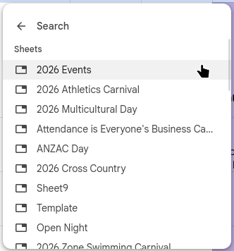

 This cannot be done on mobile as the link feature is not present. 

## Easy way
1. Select the cell you want to add a link with (Double click & CTRL + A)
2. Click the **Insert link** button in the top ribbon (CTRL + K)  
3. After the link menu pops up click the **Sheets and named ranges** button. 
4. After the menu changes select what workbook you would like to link. 

## Hard way

This way is suitable if you don't want to go back and forth

1. Open the workbook you would like to be the link **destination.** 
2. In the top address bar copy the workbook id e.g: ``#gid=XXXXXXXXXXXXX``. 
3. Select the cell you want to add a link with (Double click & CTRL + A)
4. Click the **Insert link** button in the top ribbon (CTRL + K) ![[LinkIcon.png]]
5. After the link menu pops up paste the ``#gid=XXXXXXXXX`` into the link URL and apply it.
![[GID_in_url_popup.png]]